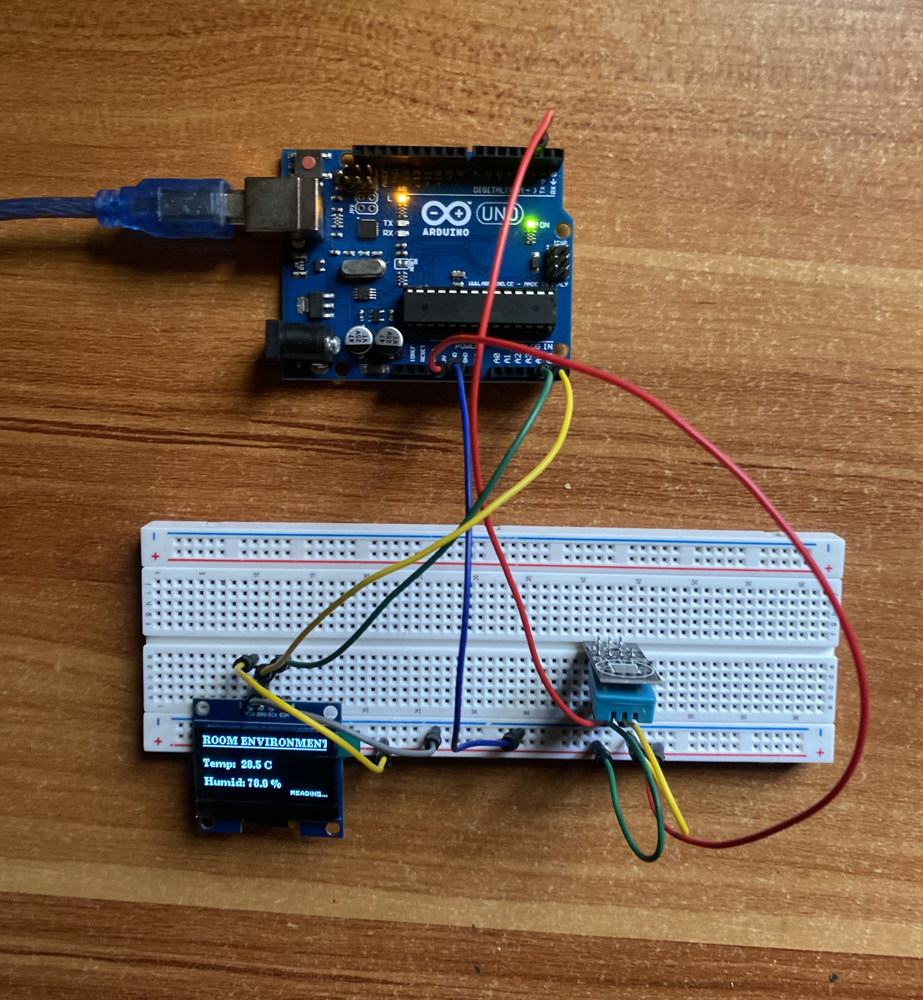

# Environmental Monitoring System (Phase 1)

This is a temperature and humidity measurement system designed to monitor room environments. It utilizes a **DHT11 sensor** for data acquisition and a **1.3" OLED (SH1106)** for clear, live visualization.

---
## Live Demo
See it in action here: [Link to my X post](https://x.com/emekabuilds_/status/2050583625188429927?s=46)


## The Build
*   **Refresh Rate:** 2 seconds — specifically optimized to match the physical sampling limits of the DHT11 sensor.
*   **Communication:** The 1.3" OLED utilizes the **I2C protocol** (SDA/SCL) for a clean, two-wire data interface.

### Pre-Optimization Error

*Figure 1: The Arduino IDE warning showing critical memory usage before the fix.*

*   **Optimization:** The system was originally hitting a **92% RAM usage error** on the Arduino Uno due to full frame buffering. I successfully resolved this by switching to **Page Buffer Mode** (`u8g2.firstPage()`), significantly reducing the memory footprint.
### Source Code Snippet
To keep RAM usage low, the system uses **Page Buffer Mode**. Instead of storing the entire screen layout in memory, it renders in smaller horizontal pages using a `do...while` loop:
```cpp
u8g2.firstPage();
do {
  // Rendering logic here
} while ( u8g2.nextPage() );
```

## Components
*   **Microcontroller:** Arduino Uno Rev3
*   **Display:** 1.3" OLED Display (SH1106 Driver)
*   **Sensor:** DHT11 Temperature & Humidity Sensor
*   **Prototyping:** 830-point Breadboard & Jumper Wires

## Wiring photo

*Figure 2: Live dashboard showing temperature and humidity readings.*

---
## Repository Structure

*   **`/src`**: Contains the source code (`.ino` files) for each development phase.
*   **`/requirements`**: Detailed breakdown of hardware components and software tools required for each phase.
*   **`/assets`**: Project documentation, including wiring photos and schematics for each phase.
*   **`README.md`**: Project overview, technical optimizations, and setup instructions.

 ---
*Built and documented by Chukwuemeka Ifeanyi | Mechatronics Engineering Student | May 2026 | [@emekabuilds_](https://x.com/emekabuilds_)*
